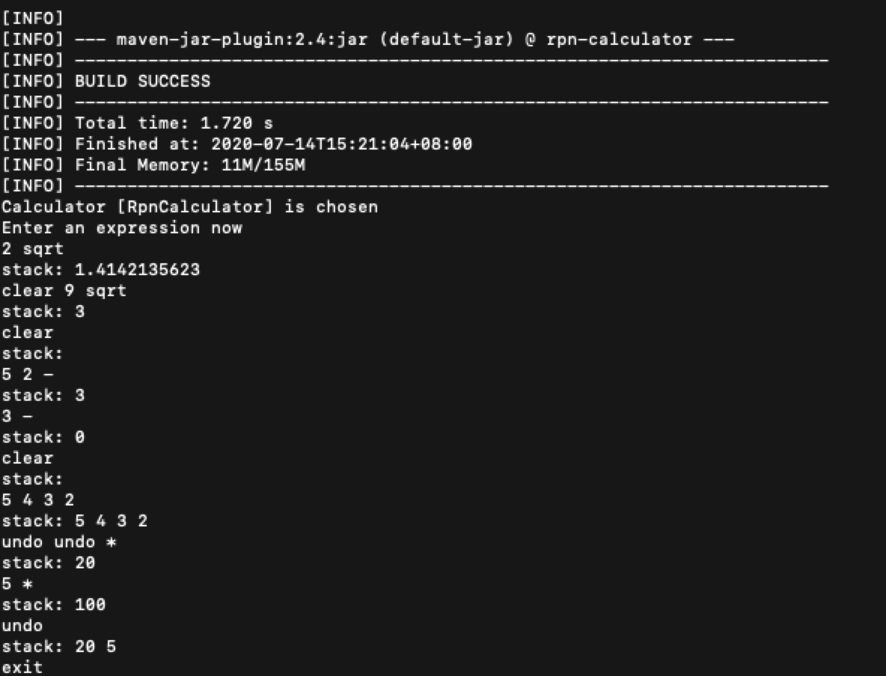
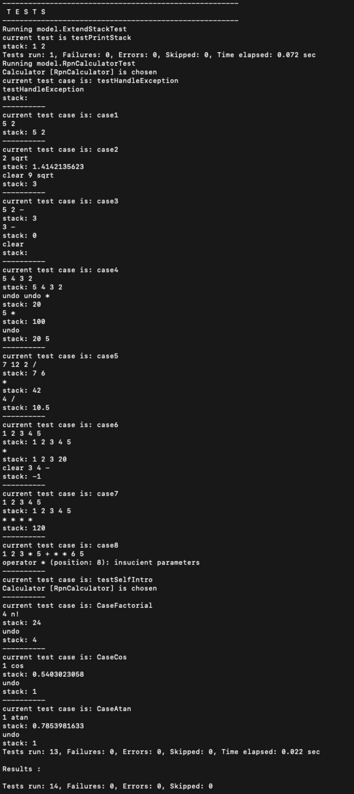

# What's this
This project implements a basic calculator including RPN-calculator using java. And users can use it via command line.

#### Stage 1: A command-line based RPN
- Basic math operators (+,-,*,/,sqrt)
- Undo and clear functionality
 
#### Stage 2: Enhanced functionalities
- More math operators, such as n!, COS, ATAN, etc
- Other operators such as redo, swap, etc. (TBD)

#### Stage 3: Online & UI (TBD)
- Bring it online
- Customize the colour of each number in the stack depends on it position.

# For users

## Run
1. try ```run_calculator.sh```, which is equivalent to following operation
    1. run ```mvn package``` to build a jar under /target
    2. run command ```java -jar target/rpn-calculator-0.0.1-SNAPSHOT.jar```  to run a rpn calculator or ```mvn exec:java``` 
2. rpn calculator is chosen by default
3. enter an expression to calculate

the actual running example:


## Test
1. try ```test.sh``` which will execute ```mvn test```

the actual testing example:


# For developers
Just share some thoughts during development to help developers go further beyond this project. In order to make project have better maintainability and extensibility, I take some of the design principle into consideration.
For example, the SOLID principle(https://en.wikipedia.org/wiki/SOLID). I abstract an interface ```model.calculator.Calculator``` for stack based calculators. For more details, please check below lists.

## Add more operators
1. just add one enum in ```enums.RpnOperator``` with implementation.
2. nothing else!

## Add more stack based calculators
1. you can implement more stack based calculators by implementing interface ```model.calculator.Calculator``` 
    1. currenty it only defines a method ```ExtendStack<Double> calculate(String input)```
    2. it also has a default method ```selfIntro()``` which you can use to introduce when specific calculator is chosen by user

# Reference
The following codes bring more idea to me and ```enums.RpnOperator``` basically extends from gvnn's project .
- [https://github.com/gvnn/rpn-calculator](https://github.com/gvnn/rpn-calculator)
- [https://gist.github.com/vise890/5902461](https://gist.github.com/vise890/5902461)